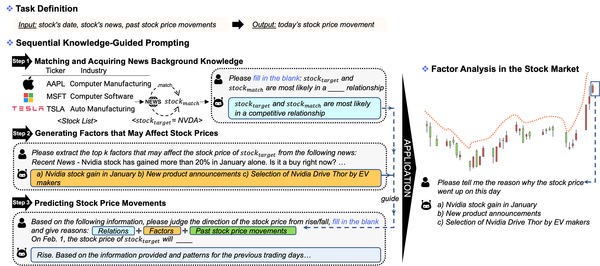

Welcome to Mei's Research World! 🌟
======

Hello, I'm Meiyun Wang (you can call me Mei 😊). Currently, I am a 2nd year PhD student in the [Department of Systems Innovation](http://www.sys.t.u-tokyo.ac.jp/en/), [School of Engineering](https://www.t.u-tokyo.ac.jp/en/soe), at [The University of Tokyo](https://www.u-tokyo.ac.jp/en/index.html).

About Me 
======

My research interests are diverse, focusing on:
- **Financial NLP**: Exploring the intersection of finance and natural language processing to derive actionable insights. 💹
- **Data Mining**: Uncovering patterns and knowledge from vast datasets. 🧠
- **Causal Inference**: Understanding and establishing cause-and-effect relationships in data. 🔍
- **Large Language Models**: Working with state-of-the-art models to push the boundaries of what's possible with AI and NLP. 🤖
- **Knowledge Distillation**: Transferring knowledge from large models to smaller, efficient ones without significant loss of performance. 📉

Feel free to explore my latest research and publications. Let's connect and delve into the fascinating world of data and innovation together! 🌐

🔥 News
======
- **2024.05**: 🎉 One paper is accepted by [ACL 2024](https://2024.aclweb.org/) (first author)

📝 Publications
======

LLMFactor (ACL Findings)
------

  
  

    <h4><a href="#">LLMFactor: Extracting Profitable Factors through Prompts for Explainable Stock Movement Prediction</a></h4>
    
Meiyun Wang, Kiyoshi Izumi, Hiroki Sakaji

    <ul>
      <li>In this study, we introduce a novel framework called LLMFactor, which employs Sequential Knowledge-Guided Prompting (SKGP) to identify factors that influence stock movements using LLMs.</li>
    </ul>
    
<strong>Citation:</strong> [1] Meiyun Wang, Kiyoshi Izumi, Hiroki Sakaji, LLMFactor: Extracting Profitable Factors through Prompts for Explainable Stock Movement Prediction, Findings of the Association for Computational Linguistics: ACL, 2024. (got my first ACL🎉)

  

