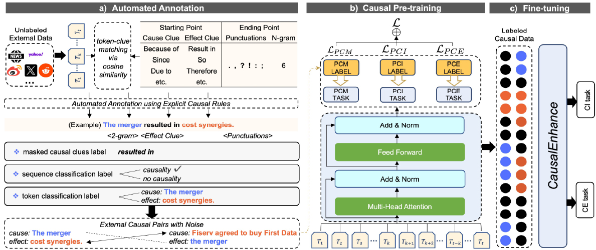

Hello, I'm Meiyun Wang. Currently, I am a 2nd-year PhD student in the [Department of Systems Innovation](http://www.sys.t.u-tokyo.ac.jp/en/), [School of Engineering](https://www.t.u-tokyo.ac.jp/en/soe), at [The University of Tokyo](https://www.u-tokyo.ac.jp/en/index.html).

## 💡 Research Focus

**My research focus is on explainable, trustworthy, and applicable AI.**

---

### 🔄 Ongoing Project

**Mitigating Hallucinations in Large Language Models:** *Training privacy-sensitive student models using synthetic data generated by large language models.*
`data augmentation`  `large language model hallucinations`  `knowledge distillation`  `domain applications`

---

### 📚 Previous Projects

**1. Factor Extraction for Time Series Data Explanation Using Large Language Models:** *Utilizing large language models to extract factors and make time series forecasting.*
`time series prediction`  `information extraction`  `prompt engineering`

**2. Risk Prediction by Combining Graph Neural Networks and Temporal Recurrent Neural Networks:** *Integrating graph neural networks and LSTM for accurate risk prediction.*
`risk prediction`  `correlation matrix`  `time series prediction`

**3. Causality-Oriented Pre-Training Framework and Data Augmentation Methods:** *Developing a pre-training framework and data augmentation methods focused on causality extraction.*
`pre-training`  `data augmentation`  `data synthesis`  `causality extraction`

**4. Application Exploration of Causality Extraction in Patent Texts:** *Exploring the application of causality extraction techniques in patent texts.*
`fine-tuning`  `causality extraction`  `similarity analysis`

## 🔥 News

- **2024.07**: I will join **Amazon Science** as a **Data Scientist Fellow** working on applying large language models (LLM) to customer recommendation problems this summer.
- **2024.05**: 🎉 One paper is accepted by [ACL 2024](https://2024.aclweb.org/) (first author)

## 📝 Publications (first author)

**[ACL 2024] LLMFactor**
<html>
    <table style="margin-left: auto; margin-right: auto; border-collapse: collapse; border: none; width: 100%;">
        <tr>
            <td style="width: 50%; border: none;">
                <!-- Left side content -->
                
            </td>
            <td style="width: 50%; border: none;">
                <!-- Right side content -->
                <a href="https://arxiv.org/pdf/2406.10811">LLMFactor: Extracting Profitable Factors through Prompts for Explainable Stock Movement Prediction</a>
                <ul>
                    <li>In this study, we introduce a novel framework called LLMFactor, which employs Sequential Knowledge-Guided Prompting (SKGP) to identify factors that influence stock movements using LLMs.</li>
                    <li><strong>Meiyun Wang</strong>, Kiyoshi Izumi, Hiroki Sakaji, LLMFactor: Extracting Profitable Factors through Prompts for Explainable Stock Movement Prediction, <em>Findings of the Association for Computational Linguistics: ACL</em>, 2024.</li>
                </ul>
            </td>
        </tr>
    </table>
</html>

**[preprint] CausalEnhance**
<html>
    <table style="margin-left: auto; margin-right: auto; border-collapse: collapse; border: none; width: 100%;">
        <tr>
            <td style="width: 50%; border: none;">
                <!-- Left side content -->
                
            </td>
            <td style="width: 50%; border: none;">
                <!-- Right side content -->
              <a href>CausalEnhance: Knowledge-Enhanced Pre-training for Causality Identification and Extraction</a>
                <ul>
                    <li>We introduce CausalEnhance, a novel knowledge-enhanced pre-training method empowered by a rule-based automated annotation system.</li>
                  <li><strong>Meiyun Wang</strong>, Kiyoshi Izumi, Hiroki Sakaji.</li>
                </ul>
            </td>
        </tr>
    </table>
</html>

**[WPI 2023] PatentCausality**
<html>
    <table style="margin-left: auto; margin-right: auto; border-collapse: collapse; border: none; width: 100%;">
        <tr>
            <td style="width: 50%; border: none;">
                <!-- Left side content -->
                
            </td>
            <td style="width: 50%; border: none;">
                <!-- Right side content -->
                <a href="https://www.sciencedirect.com/science/article/pii/S0172219023000686" style="text-decoration: none;">Discovering new applications: Cross-domain exploration of patent documents using causal extraction and similarity analysis</a>
                
                <ul>
                    <li>This study suggests an approach employing causality extraction and similarity analysis to explore a technology's applicability beyond what is explicitly stated in patents.</li>
                    <li><strong>Meiyun Wang</strong>, Hiroki Sakaji, Hiroaki Higashitani, Mitsuhiro Iwadare, and Kiyoshi Izumi, <em>World Patent Information</em>, 75:102238, 2023.</li>
                </ul>
            </td>
        </tr>
    </table>
</html>

<ul>
<li><strong>[JSAI 2023]</strong>: <a style="text-decoration: none;">New Intellectual Property Management Method Aiming at Expanding Technology Applications and Secondary Development</a>, <strong>Meiyun Wang</strong>, et al, <em>The 37th Annual Conference of the Japanese Society for Artificial Intelligence</em>, 2023.
  </li>
  
  <li>
    <strong>[ICAIF 2022]</strong>: <a style="text-decoration: none;">A New Approach to Assessing Corporate R&D Capabilities: Exploring Patent Value Based on Machine Learning</a>, <strong>Meiyun Wang</strong>, et al, <em>3rd Workshop on Women in AI and Finance, 3rd ACM International Conference on AI in Finance</em>, New York, USA, Nov 2nd, 2022.
  </li>
</ul>

## 🎖 Honors

- **2024 ~ 2025**: <a href="https://www.cis-trans.jp/spring_gx/index-e.html">Fostering Advanced Human Resources to Lead Green Transformation (SPRING GX)</a>, The University of Tokyo.
- **2023 ~ 2025**: <a href="https://gsdm.u-tokyo.ac.jp/gsdm2.0/en/wings-gsdm/">World-leading Innovative Graduate Study Program on Global Leadership for Social Design and Management (WINGS-GSDM)</a>, The University of Tokyo.
- **2023 ~ 2025**: Data Science Practicum, The University of Tokyo.
- **2023 ~ 2025**: Designing Future Society Fellowship, The University of Tokyo.

## 💻 Internships

- **2024.08 - 2024.11**: Amazon Data Scientist Fellow
- **2023.11 - 2024.01**: Mizuho, Tokyo.
- **2022.04 - 2022.07**: Google STEP, Tokyo.
- **2020.11 - 2021.08**: Tencent, Shenzhen.
- **2020.08 - 2020.11**: PingAn, Shenzhen.
